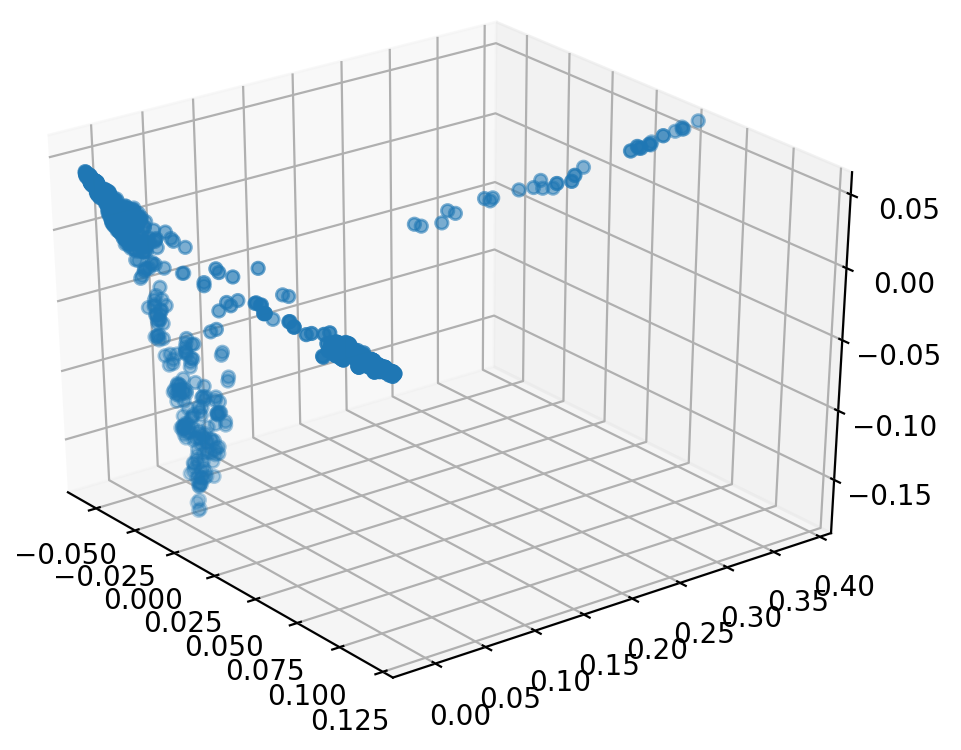

# pims-filter

This Python package is a personal information management filter (PIMS filter) for text-based user information.

Check out `example_usage.ipynb`. A sample projection of a graph representation of a PIMS to  is shown below.

## TODO

- Convert `pims-filter.py` script into a class.
  - Work TODO on submodules
    - Work on submodules is outlined in each submodule's `README`
